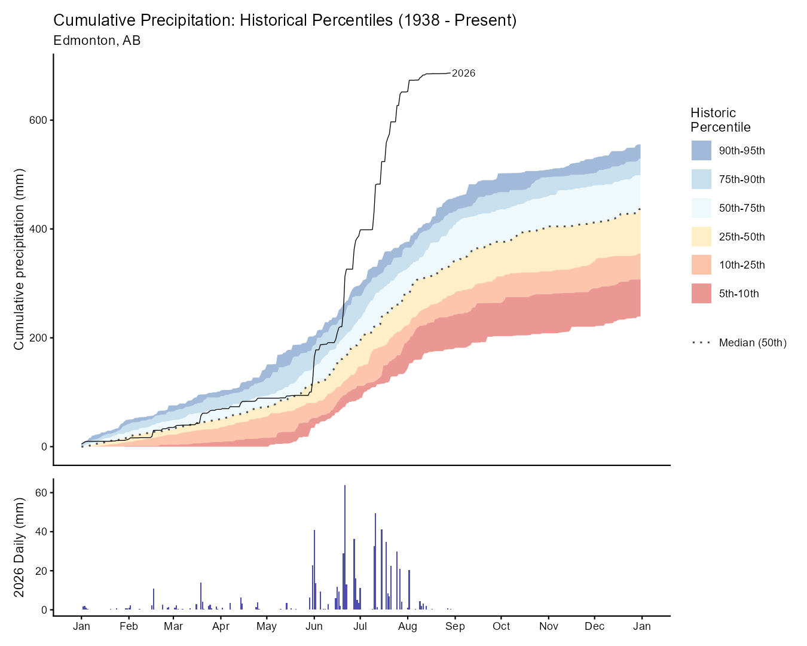

# Edmonton Year-to-Date Cumulative Precipitation

Plots Edmonton's current year cumulative precipitation against 88 years of historical percentile envelopes (1938–present).

## Quick Start

Run `R/render_plot_extended.R` to generate the plot. Current output saves to `outputs/YEG_2026_CUMUL_PRECIP_YTD_EXTENDED_<YYYYMMDD>.png`.

### Example Output

**Top panel**: Cumulative precipitation with historical percentile bands (colored regions) spanning 88 years of baseline data. The dotted median line (50th percentile) shows typical accumulation. The solid black line traces 2026 year-to-date totals, currently tracking above the median.

**Bottom panel**: Daily precipitation for 2026, showing when rain events occurred throughout the year.

## Data Sources

**Station 1867 (EDMONTON CITY CENTRE A)**
- Period: 1938–1995 (used after filtering incomplete years)
- Location: Edmonton, AB (53.57°N, 113.52°W)
- Source: Environment and Climate Change Canada (ECCC), via `weathercan` R package
- Note: Original cached data spans 1937–2005. Year 1937 excluded (92 days only). Years 1996+ not used (transition to station 27214)

**Station 27214 (EDMONTON BLATCHFORD)**
- Period: 1996–present
- Location: Edmonton, AB (53.57°N, 113.52°W)
- Source: Environment and Climate Change Canada (ECCC), via `weathercan` R package
- Note: Transitioned from City Centre location; daily data begins 1996-03-01

## Methods

### Data Processing

1. **Merging**: Station 1867 data (1938–1995) concatenated with Station 27214 live data (1996–present), creating a continuous series from 1938–present.

2. **Quality Control**: 
   - Years with fewer than 360 days of data are excluded from historical baseline calculations. This removes 1937 (92 days) and 1996 (306 days), retaining 87 complete years (1938–2025).
   - February 29 is excluded from percentile calculations to avoid discontinuities caused by leap year sampling: leap years comprise only ~27% of the historical record, creating non-monotonic percentiles at the Feb 29 → Mar 1 boundary.

3. **Cumulative Sum**: Daily precipitation values are cumulated within each calendar year (January 1 → December 31).

4. **Percentile Bands**: 
   - Daily cumulative precipitation is calculated for each historical year
   - Percentiles (5th, 10th, 25th, 50th, 75th, 90th, 95th) are computed for each day-of-year across all historical years
   - Non-overlapping bands are drawn between adjacent percentiles

### Filtering Rationale

**Incomplete years**: Years with < 360 days create non-monotonic percentiles. If an incomplete year has an outlier-low end-of-year value, lower percentiles can paradoxically decrease. Example: year 1937 (Oct 1 start) has Oct 1 cumulative = 0, dragging down the Oct 1 p5 below Sept 30 p5. Filtering ensures percentile curves remain strictly monotonic.

**Leap years**: February 29 exists only in leap years (~27% of 1938–2025 record). These years have different precipitation patterns than non-leap years, creating a discontinuity at the Feb 29 → Mar 1 boundary where p10 can drop. Excluding Feb 29 eliminates this artifact while preserving all non-leap data.

### Plot Layout

**Top panel**: Cumulative precipitation percentile envelope (bands) with median (50th percentile, dotted line) and current year (solid black line).

**Bottom panel**: Current year daily precipitation totals (bars) for reference.

## Scripts

- `R/render_plot_extended.R` — Generates plot with 1938–present baseline and data quality filtering

## Key Packages

`weathercan`, `dplyr`, `tidyr`, `lubridate`, `ggplot2`, `patchwork`, `RColorBrewer`

## Citations

**Data Source:**
Environment and Climate Change Canada (ECCC). (2026). *Canadian climate normals and historical climate data*. Accessed via weathercan R package.

**Software:**
Stefantsova, M., & Thornton, P. (2023). weathercan: Download weather data from Environment and Climate Change Canada. R package version 0.7.2. https://github.com/ropensci/weathercan

**References:**
- Environment and Climate Change Canada. Terms and conditions. https://climate.weather.gc.ca/prods_servs/attachment1_e.html
